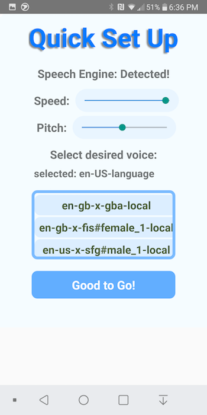
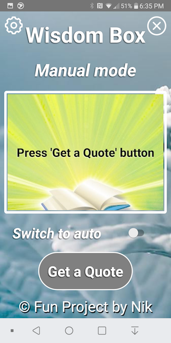

In the project directory, you can run:

### `react-native run-android`

Open development options:
### `adb shell input keyevent 82`

### Deployment

APP deployed at Google Play: https://play.google.com/store/apps/details?id=com.wbox

## Project Screenshots:

